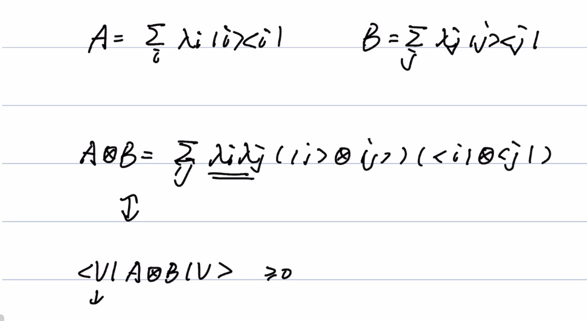
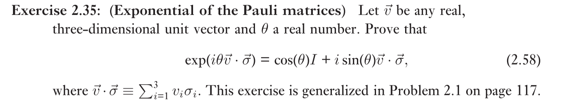
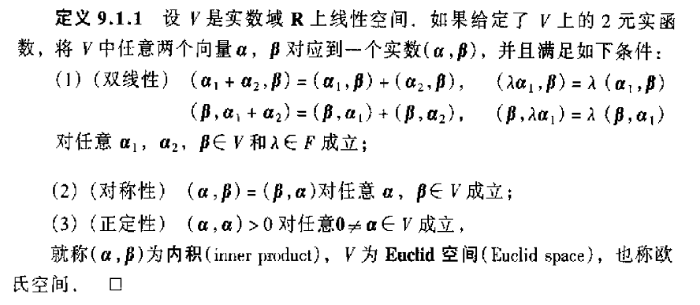

# 2.1.5 特征向量和特征值

## 2.21

**Repeat the proof of the spectral decomposition in Box 2.2 for the case when M is Hermitian, simplifying the proof wherever possible.**

这个题让证明 Hermitian 算子的谱分解定理，也就是任意【Hermitian】算子《在V的某组正交基下是可对角化的

模仿定理2.1的证明

使用数学归纳法，对空间的维度进行归纳。

设 $\lambda$ 是 M 的一个特征值， P 是到 特征子空间上的投影，Q是P的正交补，我们要证明:
* M = PMP + QMQ
* PMP 和 QMQ 都是可对角化的。

**由此可以得到 M 是可对角化的**（以为两个相互正交的子空间都是可对角化的）

下面补充证明上面提到的两点：

**M = PMP + QMQ**

P的正交补就是 I - P ，因为 $P(I - P) = P - P^2 = 0$

$M = (P+Q) M (P + Q)$ = PMP  + QMQ + PMQ + QMP

QMP = QP = 0 (投影的性质)

 $P^\dagger = P$, 因此$Q^\dagger = (I-P)^\dagger = I - P = Q$


因此 $PMQ = (Q^\dagger M^\dagger P^\dagger)^\dagger = (QMP)^\dagger = 0$

因此 M = PMP + QMQ

**PMP 和 QMQ 可对角化**

PMP是投影算子，自然可对角化

由于 
Q = I - P
$$
\begin{aligned}
    (QMQ)^\dagger &= Q^\dagger M^\dagger Q ^\dagger \\
    &= QMQ
\end{aligned}
$$

因此 QMQ 是 Hermitian 的，是可对角化的


---

## 2.22

**Prove that two eigenvectors of a Hermitian operator with different eigenvalues are necessarily orthogonal.**

先证明 **Hermite矩阵的特征值都是实数**

H 是 normal 的因此可对角化 $H = \sum_i \lambda_i |i\rangle \langle i|$

 $H^\dagger =H$

$H^\dagger = ( \sum_i \lambda_i |i\rangle \langle i|)^\dagger = \sum_i \lambda_i^*|i\rangle \langle i|$ 

因此 $\lambda_i = \lambda_i^*$，即特征值都是实数


假设 特征值 $\lambda_1,\lambda_2$ 对应的特征向量是 $|x\rangle , |y\rangle$

则有
$$
H|x\rangle = \lambda_1 |x\rangle,H|y\rangle = \lambda_2 |y\rangle
$$
由此得到
$$
\begin{aligned}
\langle y| H|x\rangle = \lambda_1\langle y|x\rangle
\end{aligned}
$$

并且

$$
\begin{aligned}
    
    &\langle x| H|y\rangle = \lambda_2\langle x|y\rangle\\
    &\langle y|H^\dagger |x\rangle = \lambda_2^* \langle y|x\rangle\\
    &\langle y|H|x\rangle = \lambda_2 \langle y|x\rangle
\end{aligned}
$$

比较上面两个式子，由于 $\lambda_1\ne \lambda_2$，只能是 $\langle y|x\rangle  = 0$ 

---

## 2.23

**Show that the eigenvalues of a projector P are all either 0 or 1.**

投影算子是幂等的

$$
\lambda |x\rangle = P|x\rangle = P^2|x\rangle = \lambda^2 |x\rangle
$$

因此 $\lambda^2 = \lambda$，$\lambda$ 是0或1

---

## 2.24

**(Hermiticity of positive operators) Show that a positive operator is necessarily Hermitian. (Hint: Show that an arbitrary operator A can bewritten A = B + iC where B and C are Hermitian.)**

由 positive 证明  Hermitian

将 A 的实数部分和虚数部分分开得到 $A = B + i C$，其中 B C 都是实矩阵。

对任意**实**向量 $\langle v|$，有 

$$
\langle v|A|v\rangle  = \langle v|B|x\rangle  + i\langle v|C|v\rangle  \in \R
$$

因此上式的虚部恒等于0，$C = 0$

下面只需证明$B$是对称的即可说明 A 是 Hermitian 的

任取 $v\in \R^n$

$$
(|v\rangle ,B|v\rangle ) = \langle v|B|v\rangle  = (B^T|v\rangle , |v\rangle ) = (|v\rangle , B^T|v\rangle ) 
$$


**引理**：如果 $<v|A|v> = 0$ 对于所有复向量v 成立，则 A = 0

> 证明：
> 对向量 x + k y($k\in \Z$)
> $$
> \begin{aligned}
> <x + k y | A | x + k y> &=k<x|A|y> + \bar k <y|A|x>\\
> &= k u + \bar k \bar u (u = <x|A|y>) = 0
> \end{aligned}
> $$
>  
> 分别取 k = 1, k = i,解上述方程组得到 $u= \bar u = 0$
> 因此 <x|A|y> = 0 对于任意x,y成立，因此 <x|A =0 对于任意x成立，因此A = 0

由于 $(|v\rangle ,B|v\rangle ) =  (|v\rangle , B^T|v\rangle )$

$(|v\rangle ,(B - B^T)|v\rangle )  = 0$对于任意v成立，由引理得到 $B - B^T = 0,B =B^T$，B是对称矩阵

A = B + iC = B 是Hermitian矩阵

## 2.25
**Show that for any operator $A, A^\dagger A$ is positive.**

对任意x
$$
\langle x|A^\dagger A|x\rangle = (A|x\rangle , A|x\rangle) \ge 0
$$

that means $AA^\dagger$ is positive


# 2.1.7 Tensor product （张量积）

两个向量空间（分别m,n维），张成m * n 维的线性空间，对于新的集合，类似于原来两个集合进行集合的乘法运算。

给出了张量积的几条性质，这几条性质是为了张成的空间仍然是**线性空间**。

然后介绍了一种具体的内积：*Kronecker Product* ，给出了对矩阵的具体操作方法，是张量积的一个具体的例子。

符号 $\otimes$ 表示张量积，$|\psi>^{\otimes 2}$ 表示 $|\psi> \otimes |\psi>$


> note:
>
> **算子和矩阵**
>
> 算子是抽象的概念，矩阵是具体的概念
>
> 一个算子可以有伴随，它的定义是满足
>
> $(|v>, A|w>) = (A^\dagger|v>, |w>)$ 的算子
>
> 而对应到我们对于内积的一般定义，伴随就是共轭转置
>
> 对于算子来说，没有共轭这个概念，也没有转置这个概念

## 2.26

$$
|\psi> ^{\otimes 2} = 1/2(|00> + |01> + |10> + |11>) 
$$

$$
|\psi> ^{\otimes 3} = 1/2\sqrt 2(\sum_{x,y,z = \{0,1\}}|xyz>) 
$$

矩阵形式

$$
|\psi> = 1/\sqrt 2\left[\begin{matrix}
    1\\1
\end{matrix}\right]
$$

使用MMA的KroneckerProduct函数

$|\psi>^{\otimes 2} = (1/2, 1 , 1, 2)^T$

$|\psi>^{\otimes 3} = 1/2\sqrt 2(1,2,2,4,2,4,4,8)^T$


## 2.27

**Calculate the matrix representation of the tensor products of the Pauli operators (a) X and Z;(b) I and X;(c) X and I. Is the tensor productcommutative?**

不可交换

计算MMA代码如下：

```mathematica
x = {{0, 1}, {1, 0}};
y = {{0, -I}, {I, 0}};
i = IdentityMatrix[2]
z = {{1, 0}, {0, -1}};
KroneckerProduct[x, z] // MatrixForm
KroneckerProduct[i, z] // MatrixForm
KroneckerProduct[x, i] // MatrixForm
```

## 2.28

**Show that the transpose, complex conjugation, and adjoint operations distribute over the tensor product,(A⊗B)∗ = A∗ ⊗B∗;(A⊗B)T = AT ⊗BT;(A⊗B)† = A† ⊗B†.(2.53)**

这里说的张量积应该指的是Kronecker张量积，（不然这些符号都没定义）

**转置**：

A 是 m乘n矩阵，B是p乘q矩阵

$A\otimes B _{i,j}= A_{i// p, j // q} \cdot B_{i\%p, j\%q}$
（下标从0开始

由上式可容易地得到关于转置的这个性质

**共轭**：

对于复数 z1, z2，容易验证 $z_1^* z_2^* = (z_1 z_2)^*$

利用这条性质容易验证

## 2.29

**Show that the tensor product of two unitary operators is unitary.**

$U_1, U_2$ are unitary

then we have $U_1^\dagger U_1 = I_1,U_2^\dagger U_2 = I_2$

$(U_1 \otimes U_2 )^\dagger(U_1 \otimes U_2 ) =U_1^\dagger U_1 \otimes U_2 ^\dagger U_2 = I_1 \otimes I_2$

## 2.30

**Show that the tensor product of two Hermitian operators is Hermitian.**

$(H_1 \otimes H_2)^\dagger = H_1^\dagger \otimes H_2^\dagger = H_1\otimes H_2$

## ==2.31==

**Show that the tensor product of two positive operators is positive.**

设 A,B 正定，$|u>, |v>$ 不全为零
$$
(|u>\otimes |v> , (A\otimes B)( |u>\otimes |v> ) ) = <u|A|u> <v|B|v> \ge 0
$$
即AB的张量积半正定

==张量空间的元素是|v> |u> 的线性组合==



谱分解 - -- 半正定

==证明== todo

## 2.32

**Show that the tensor product of two projectors is a projector.**

投影算子A,B可以写成

$A = \sum _{i \in S_1} |i><i|, B = \sum_{j \in S_2} |j><j|$

则 $A \otimes B = \sum_{i,j} |i><i| \otimes |j><j| = \sum _{i,j} (|i> \otimes |j>)(<i| \otimes <j|)$

易证 $|i> \otimes |j>, |i> \in S_1, |j> \in S_2$ 是一组标准正交基，因此 $A\otimes B$ 也是投影向量


## 2.33

$$
H^{\otimes 2} = \frac 12 \left[
    \begin{matrix}
        1 & 1 & 1&1\\
        1 & -1& 1& -1\\
        1 &1&-1&-1\\
        1&-1&-1&1
    \end{matrix}
\right]
$$


$(-1)^{x\cdot y}$ 是对应矩阵 x行y列的元素 ==点积==

$x\cdot y$ 这个符号是 x，y按位与，然后数里面1的个数

**使用数学归纳法证明**

假设对 n 成立，
$$
\begin{aligned}
    H^{\otimes n} &= \frac{1}{\sqrt{2^n}} \sum_{x,y} |x> <y|\\

    H^{\otimes (n +1 )} &= H^{\otimes n} \otimes H \\
    &= \frac{1}{\sqrt{2^(n + 1)}}( \sum_{x,y}(-1)^{x\cdot y} |x> <y|) \otimes (|0><0| + |1><0| + |0><1| - |1><0|)\\
    &= \frac{1}{\sqrt{2^(n + 1)}}( \sum_{x,y}(-1)^{x\cdot y} |x0> <y0| + |x1><y0| + |x0><y1| - |x1><y1|)\\
    &=  \frac{1}{\sqrt{2^(n + 1)}}( \sum_{x,y}(-1)^{x\_ \cdot y\_} |x\_> <y\_|)
\end{aligned}
$$
因此上式对于 n + 1 也成立

由归纳法。原命题成立


# 2.1.8 算子函数 Operator functions

这一节首先介绍了给一个正规矩阵施加某个函数

$f(A) = \sum_a f(a) |a><a|$

步骤是

* 谱分解
  * 求特征值和特征向量
  * 特征向量单位正交化
* 求f(A)

然后介绍了矩阵的trace（迹

---
## 2.34


$$
x_1 = \frac{1}{\sqrt{2}}[1,1]', x_2 =\frac{1}{\sqrt{2}} [-1,1]'\\
M= \left[
    \begin{matrix}
        4 & 3\\
        3&4
    \end{matrix} 
\right] = 7 x_1 \cdot x_1' + x_2 \cdot x_2'
$$
平方根：
$$
\sqrt M = \sqrt 7 x_1 \cdot x_1' + x_2 \cdot x_2'\\
ln(M) = ln(7)x_1 \cdot x_1' +ln(1) x_2 \cdot x_2' = ln(7) x_1 \cdot x_1'\\
$$

## 2.35


$$
\vec v \cdot \vec \sigma = \left[
    \begin{matrix}
        v_3 & v_1 - i v_2\\
        v_1 + i v_2 & -v_3
    \end{matrix}
\right]
$$
求上式的特征值和特征向量

特征值为 1,-1

设特征向量 $x_1, x_2$

则$\vec v \cdot \vec \sigma  = |x_1><x_1|- |x_2><x_2|$
$$ { }
e^{(i \theta v \sigma )} &= exp\{ i\theta|x_1><x_1|- i\theta|x_2><x_2|\}\\
&=e^{i\theta} |x_1><x_1| + e^{-i\theta} |x_2><x_2|\\
&= cos(\theta)(|x_1><x_1| +|x_2><x_2| ) + i\sin(\theta) (|x_1><x_1| -|x_2><x_2| )\\
&= cos(\theta) I + i sin(\theta) v\sigma
$$


## 2.36

Show that the Pauli matrices except for I have trace zero.

直接验证

## 2.37


$A: n\times m,b :m\times n$
$$
tr(AB) &= \sum_{i = 1}^n \sum_{j =1}^m A_{i,j} B_{j,i}\\
&= \sum_{j = 1}^m \sum_{i = 1}^n{B_{j,i}} A_{i,j}\\
&=  \sum_{j = 1}^m (BA))_{jj} = tr(BA)
$$

## 2.38


直接验证


> note:
>
> 希尔伯特空间和欧氏空间
>
> 希尔伯特空间是欧式空间的一个推广，使之不局限于实数的情形和有限的维数
>
> 希尔伯特空间的定义是**完备的内积空间**
>
> 欧氏空间
>
> 


## 2.39


（1）

* $(A, \sum _i b_iB_i) = \sum_i b_itr(A^\dagger B_i)  =\sum _i b_i (A, B_i)$
* $(A,B) = tr(A^\dagger B) = tr(AB^\dagger)^* = tr(B^\dagger A) ^*= (B,A)^*$
* 当 $A\ne 0$ 时， $(A,A) = tr(A^\dagger A)$ ，因为 $A^\dagger A$ 正定，因此 $(A,A) \gt 0$

（2)

我的理解是 V 是 n为向量， $L_v$ 是 $n\times n$ 矩阵

（3）


# 2.1.9 对易式和反对易式 commutator and anti-commutator


> 证明：
>
> 可同时对角化 推出 [A,B] = 0
>
> 设 $P^{-1} AP = D_1, P^{-1} BP = D_2$
>
> $AB - BA = PD_1D_2P^{-1} - PD_2D_1P^{-1} = 0$
>
>  [A,B] = 0 推出 可同时对角化
>
> TODO

## 2.40 41

略，直接验证

## 2.42

$$
\frac{[A,B] +\{A,B\}}{2} =\frac{AB -BA +AB +BA}{2} = AB
$$

## 2.43

利用 2.40-2.43的三个式子直接验证，考虑 j =k 和 j 不等于k

## 2.44

$$
AB - BA = 0\\
AB +BA = 0
$$

因此， $AB = 0, BA = 0$

又因为 A可逆， $B = A^{-1} \cdot 0 = 0$  

## 2.45

$$
[A,B]^\dagger = (AB - BA )^\dagger = (AB)^\dagger - (BA)^\dagger = B^\dagger A^\dagger - A^\dagger B^\dagger  = [B^\dagger, A^\dagger]
$$

## 2.46

直接验证

## 2.47

$$
(i[A,B])^\dagger = (i(AB - BA))^\dagger = (-i)[B^\dagger, A^\dagger] = i[A,B]
$$

其中用到了上面两道题的结论

# 2.1.10 极式分解和奇异值分解

A 是向量空间上的线性算子

**极式分解**： 
$$
A = UJ = KU
$$
其中 U is unitary , and K, J are positive

$J = \sqrt {A^\dagger A}, K = \sqrt{AA^\dagger}$

如果A可逆， U唯一

**奇异值分解**

A 是一个方阵
$$
A = UDV
$$
U, V : unitary

D : 非负对角阵（对角元为A的奇异值 eigenvalue）

> $A =  SJ$
>
> $J = TDT^\dagger$
>
> $A = STDT^\dagger = UDV$
>
> $U = ST, V = T^\dagger$ 

## 2.48

**What is the polar decomposition of a positive matrix P? Of a unitary matrix U? Of a Hermitian matrix, H?**

* positive

  $P = S\sqrt{P^\dagger P} = SP$ （实际上，对于奇异值为实数的可对角化矩阵P, $\sqrt{P^\dagger P} = P$

  $J=P, S = I$

  对$J$进行奇异值分解， $P = J= TDT^\dagger$

* unitary

  对角矩阵D满足 $D^\dagger D = I$ ，因此$D$ 的对角元模都为1

  $U = TDT^\dagger$

* Hermitian

  $H = TDT^\dagger$

  其中 D 是实对角矩阵

上述T都是unitary


## 2.49

**Express the polar decomposition of a normal matrix in the outer product representation.**

> note:
>
> 谱分解定理表明：
>
> operatorcan be expressed as $A = \sum_i \lambda_i |i><i|$ under an orthorgornal basis
>
> 也就是说，算子A在某个基下可以被写成一个对角矩阵，上述这个写法$A = \sum_i \lambda_i |i><i|$的意思就是在$|i>$ 这组基下， A是对角阵。
>
> “因为A是正规算子，因此把A写成 $A = \sum_i \lambda_i |i><i|$ 这个形式”其实已经指定了基，在这组基下，算子$\mathcal A$对应的矩阵 A 是对角阵， 算子$\mathcal A$作用于V中的向量v, 相当于 A 矩阵乘v在 $|i>$ 下的坐标
>
> 有基，才有坐标，才有算子对应的矩阵
>
> **外积表示**
>
> 外积表示本质是算子的外积表示
>
> 至于
> $$
> \sum _i |i><i| = I
> $$
> 中的I，我觉得也是算子而不是矩阵，只不过在基$|i>$ 下是单位矩阵

矩阵要想有算子表示就必须要有**基**

$A = \sum_i \lambda_i |i><i|$ 是在这个基下，A矩阵对应的算子是 $\sum_i \lambda_i |i><i|$， 并不代表他在其他基下面的算子表示

//$A = TDT^\dagger$

这里还么想清楚


## 2.50

$$
A = UJ\\
J = \sqrt{A^\dagger A}, U = AJ^{-1}
$$

算吧！


---

author: <font color = green>banana889</font> 

date: 2022-7-x