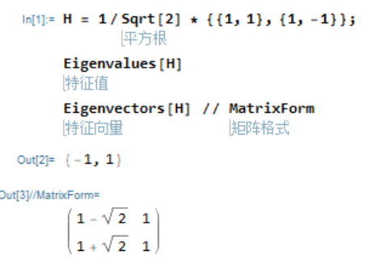
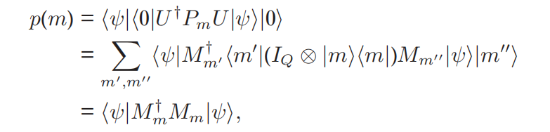
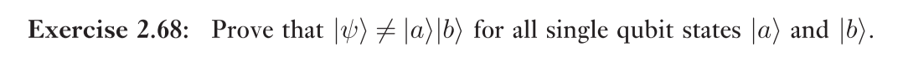

# 2.2 The postulates of quantum mechanics

postulates - 公设

# 2.2.1 State space

# 2.2.2 Evolution

## notes

## exercise

**2.51 Verify that the Hadamard gate H is unitary.**

$$
H = \frac 1{\sqrt 2}\left[\begin{matrix}1&1\\1&-1\end{matrix}\right]
$$

$H^\dagger H = I$

---

**2.53 What are the eigenvalues and eigenvectors of H?**

---

**2.54 Suppose A and B are commuting Hermitian operators. Prove that exp(A)exp(B)= exp(A + B). (Hint: Use the results of Section 2.1.9.)**

AB是可对易的 Hermitian 算子， 因此可同时对角化

在某组基下，

$A = \sum_i \lambda_i |i><i|, B = \sum _i \lambda_i' |i><i|$

因此

$$
exp(A)exp(B) = \sum_i e^{\lambda_i} |i><i| \sum _i e^{\lambda'_i} |i><i|\\=\sum_i e^{\lambda_i +\lambda_i'} |i><i| \\= exp(A+B)
$$

---

**2.55 Prove that U(t1,t2) defined in Equation (2.91) is unitary.**

- note: $exp(a^*) = (exp(a))^*, log(a^*) = (log(a))^*$ 可以用Euler公式证明
  
    

$$
U^\dagger U = exp(\frac{iH^\dagger(t_2 - t_1)}\hbar) exp(\frac{-iH(t_2 - t_1)}\hbar)\\= exp(\frac{i(H^\dagger-H)(t_2 - t_1)}\hbar)\\ = exp(0)\\ = I
$$

emmmm这里有一点不严谨， 就是怎么证明$(exp(A))^\dagger = exp(A^\dagger)$

---

**2.56 Use the spectral decomposition to show that K ≡−i log(U)is Hermitian for any unitary U, and thus U=exp(iK) for some Hermitian K.**

由谱分解定理，在某组基下 $U = \sum_i \lambda_i |i><i|$ 

$$
\begin{aligned}K^\dagger - K &= ilog(U^\dagger) -(-i\ log(U))\\&=i(log(U^\dagger)+log(U))\\&= i(\sum_i log(\lambda_i)^*|i><i|+\sum_i log(\lambda_i)|i><i|)\\&=i(\sum_i log(\lambda_i\lambda_i^*)|i><i|\\&= 0\end{aligned}
$$

thus K is Hermitian

# 2.2.3 Measurement

## notes

公设3

## exercises

### 2.57 (Cascaded measurements are single measurements) Suppose {Ll} and {Mm} are two sets of measurement operators. Show that a measurement defined by the measurement operators {Ll} followed by a measurement defined by the measurement operators {Mm} is physically equivalent to a single measurement defined by measurement operators {Nlm} with the representation Nlm ≡ MmLl.

**两次测量**

第一次测量完毕：

概率 

$$
p(l) =<\psi|L_l^\dagger L|psi> 
$$

状态

$$
\frac{L|\psi>}{c\sqrt{<\psi|L_l^\dagger L_l|\psi>}}
$$

第二次测量完毕：

概率

$$
p(m|l) = \frac{<\psi|L^\dagger M^\dagger ML|\psi>}{<\psi|L_l^\dagger L_l|\psi>}
$$

状态

$$
\frac{ML|\psi>}{\sqrt{<\psi|L^\dagger M^\dagger ML|\psi>}}
$$

两次测量状态为 l,m 的概率为

$$
p(lm) = p(l) * p(m|l) = <\psi|L^\dagger M^\dagger ML|\psi>
$$

**一次测量**

$$
p(lm) = <\psi|(LM)^\dagger LM|\psi> = <\psi|L^\dagger M^\dagger ML|\psi>
$$

状态：

$$
\frac{ML|\psi>}{\sqrt{<\psi|L^\dagger M^\dagger ML|\psi>}}
$$

由上面的讨论可知，分两次测量与一次测量的概率、最终状态是一样的，因此等价

# 2.2.4 Distinguishing quantum states

正交态可区分，非正交态不可区分。

1. 正交态可区分：

可以构造一组测量算子用于区分正交态

1. 分正交态不可区分

证明见课本，要点是把$|\phi_2>$ 分解为$\alpha |\phi_1> +\beta |\phi>$其中$|\phi_1>, |\phi>$ 正交

# 2.2.5 投影测量

投影测量是公设3的一个特例，测量算子都是投影算子，有一些比较好的特殊性质。

- 计算测量值的均值：

$$
E(M) = \langle\phi|M|\phi\rangle
$$

M的均值一般简写为$<M>$

- 标准差

$$
[\Delta (M)]^2 = <M^2> - <M>^2
$$

- **不确定原理**

由Caughy不等式推导而来

$$
\Delta(C)\Delta(D) \ge \frac{|<\phi | [C,D]|\phi>|}{2}
$$

## Exercise

### 2.58

Suppose we prepare a quantum system in an eigenstate |ψ of some observable M, with corresponding eigenvalue m. What is the average observed
value ofM, and the standard deviation?

$$
E(M) = <\phi|M|\phi> = m<\phi|\phi> =m \\
(\Delta (M))^2 = <M^2> - <M>^2= <\phi|M^2|\phi>-m ^2 = m^2 -m ^2 =0 
$$

### 2.59

$E(M) = [1,0] X [1,0]' = 0$

$(\Delta (M))^2 = <M^2> - <M>^2 =  [1,0] X^2 [1,0]' - 0 = 1$

$\Delta (M) = 1$

### 2.60

特征值为 $\pm 1$在 2.35已经证明过，直接求即可

$$
\vec v \cdot \vec \sigma = \left[
    \begin{matrix}
        v_3 & v_1 - i v_2\\
        v_1 + i v_2 & -v_3
    \end{matrix}
\right]
$$

$$
(\vec v \cdot \vec \sigma \mp I)\cdot (P_\pm) = (\vec v \cdot \vec \sigma \mp I)\cdot (I \pm \vec v \cdot \vec \sigma)/2 = \pm ((\vec v \cdot \vec \sigma)^2 - I) = 0
$$
因此 $(\vec v \cdot \vec \sigma )\cdot (P_\pm) = \pm P_\pm$, 因此$P_\pm$ 是特征值对应的投影算子

### 2.61

$$
p(+1) = < 0|P_{+1} |0> = (v_3 + 1) /2 
$$
测量之后的状态：
$$
\frac{P_{+1}|0>}{\sqrt{v_3 + 1}} = \frac{1}{\sqrt{2 (v_3 + 1)}} [v_3 + 1, v_1 + i v_2]'
$$

# 2.2.6 POVM测量

### 2.62

测量算子和 POVM元一致也就是说
$M_m = E_m = M_m^\dagger M_m$
对于任意 m 成立

因此$M_m$是 Hermitian 的，$M_m^\dagger M_m = M_m^2 = M_m$，所以$M_m$ 是幂等的，因此是投影算子，因此这个测量是投影测量

### 2.63

将$M_m$ 极式分解为 $M_m = U\sqrt{M_m^\dagger M_m} = U\sqrt{E_m}$

### 2.64

需要保证$<\phi_i|E_j|\phi_i> = 0(i \ne j)$

# 2.2.7 Phase 相位

### 2.65

这个题不清楚是想让我干什么

$(|0> - |1>)/\sqrt{2} = (|0> + exp{(i\pi)}|1>)/\sqrt{2}$

# 2.2.8 Composite systems 复合系统

## Exercise

### 2.66
把这个向量写成在基下的向量：$[1,0,0,1]'$
$$
\left[
    \begin{matrix}
        1 ,0 ,0 ,1 
    \end{matrix}
\right]
X_1Z_2
\left[
    \begin{matrix}
    1\\0\\0\\1
    \end{matrix}
\right]
 = \left[
    \begin{matrix}
        1 ,0 ,0 ,1 
    \end{matrix}
\right]
\left[\begin{matrix}0 & 0 & 1 & 0\\0 & 0 & 0 & -1\\1 & 0 & 0 & 0\\0 & -1 & 0 & 0\end{matrix}\right]
\left[
    \begin{matrix}
    1\\0\\0\\1
    \end{matrix}
\right] = 0
$$

> note
>
> 关于这个证明（中文版教材p81）的思路（证明一般测量可以表示为投影测量的酉演化
> * 先取了一个酉算子
> * 证明这个酉算子可以被扩张到符合空间
> * 取了一个投影算子
> * 证明符合空间上经过U算子作用后的系统上进行投影测量得到的结果（概率、最终状态）和原来那个一般测量一样，说明等价性
>
> 整个证明过程构造性非常强，$U$、$P_m$ 都是不加说明地直接写出来的。
>
> ==todo==
> 想要解释清楚加入辅助系统的本质目的是什么
>
> 感觉就是把原来的测量算子放到了U里面，辅助状态空间被U作用后是为了选择相应的测量算子。
>
> 
> 主要体现在上面这个式子
> 
> 很巧妙！
### 2.67

找 W 的一组标准正交基 |1> ,...,|m>

将这组基扩充为 V 的标准正交基 |1> ,..., |m> ,...,|n>

定义 U': 
$$
U'|i> = \begin{cases}
    U|i>, i\le m\\
    |i> , m \lt i \le n
\end{cases}
$$

下面证明 U' 是unitary的

对于V中的元素$|v>$, 可以分解为$|w_1> + |w_2>, w_1 \in W, w_2 \in V-W$

$$
\begin{aligned}
<v|U^\dagger U|v'> &= <w_1|U^\dagger U|w_1'> + <w_2|U^\dagger U|w_2'> + <w_1|U^\dagger U|w_2'> + <w_2|U^\dagger U|w_1'>\\ 
=& <w_1|w_1'> + <w_2 | w_2'> \\

\end{aligned}
$$
而 
$$
<v|v'> = <w_1|w_1'> +  <w_1|w_2'> +  <w_2|w_1'> +<w_2|w_2'> =<w_1|w_1'> +  <w_1|w_2'> = <v|U^\dagger U|v'> 
$$

因此对于任意 v， v',
$$
<v|v'>  =  <v|U^\dagger U|v'> 
$$
因此$|v'>  =  U^\dagger U|v'>$ 对于任意v'成立，这就证明了U是酉算子

---

### 2.68

设 $|a> = a_1|0> + b_1|1>, |a> = a_2|0> + b_2|1>$

$a_1, a_2, b_1, b_2 \in C$

suppose that  $|ab> = a_1a_2|00> + a_1b_2|01> + b_1a_2 |10> + b_1b_2|11> = |\phi>$

then we have $a_1b_2 = 0, b_1a_2 = 0$

$a_1b_2 = 0$意味着 $a_1 =0 || b_2 = 0$

这与 $a_1a_2 =b_1b_2= 1/\sqrt2$矛盾，
因此假设不成立
