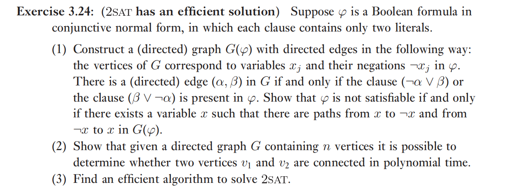
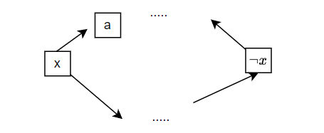

# Chapter 3 Introduction to computer science

## Exercise

### 3.3 3.4 

让构造有某个功能的图灵机，不太会

### 3.5

这个题类似于集合论里面的那个命题，不存在包含所有集合的集合，只需要构造“不包含自己的集合”就行了

证明方法就是制造矛盾。假设有算法可以判断，那图灵机就可以用这个算法判断自己是否能停机，构造一个图灵机，当算法的结果是“不能停机”的时候停机，反之不停机

### 3.15

这个习题有点意思，是证明排序算法复杂度的下限

感觉这个题目是默认 n 远大于 k 的，因此

首先证明采取了 $k$ 次比较和交换之后，最多 $2^k$ 个可能的初始列表会按照正确的顺序排好。

pf：

算法就是每次只能比较和选择交换或者不交换某两个元素(这两个元素在列表中的位置是确定的，是由算法确定的)，经过k次比较，每次比较可以选择交换或者不交换，因此最终有 $2^k$ 种可能的情况。这就说明可以被在k次操作之内排序的列表数量不超过 $2^k$ ，下面证明这个数字是可以达到的。

下面可以证明这 $2^k$ 种可能情况可以构造 $2^k$ 种序列，

例如 第一次比价前两个，第二次比较 3，4个，以此类推（假设列表中元素两两不同），这就能构造出 $2^k$ 个列表。

---

$$
2^k = \Omega(n!) = \Omega(n^{n + \frac{1}{2}})\\
k = \Omega(n \ log(n))
$$

---

> 突然想到，某神秘的桶排序不受这个限制，因为他不是由比较和交换完成的，因此是不是用桶排序缩小一般排序问题的范围（也就是分治），再使用别的排序方法，就有可能突破这个限制呢？（瞎想的，没什么依据）

### 3.16

https://cs.stackexchange.com/questions/82271/how-to-show-that-hard-to-compute-boolean-functions-exist

这是一个答案，答案本身我也没看太懂，大概是估计用m个门能搭成的nbit输入电路的个数。

然后将 2^n/n 代入m，和 $2^{2^n}$ 比较

（因为nbit输入的bool函数有 $2^{2^n}$ 个。

---

### 3.18

P中的语言在 $NP \cap coNP$ 中，两者不相等，说明

或者存在在 NP中但是不在coNP中的L，这个L自然也不再 P 中，由此证明 $P \ne NP$

或者存在在 coNP 但是不在NP中的L， 这个L不在P中，但是L的补集在 NP 中，但是不在 P 中，这就证明了 $P \ne NP$

---

### 3.24

this problem is interesting

(1) 

大概就是这么个意思，假设 x是真的，要让最终结果为真，必须让a为真，....由此一步一步推知要让 $\lnot x$ 为真，这和 x真矛盾。

x假的情况同理，因此$\phi$ 不可满足

当 $\phi$ 不可满足的时候，要证明存在 x，。。。

或者证明如果不存在成环的这种情况，则必然可以满足。这个也不好证。。。

==todo== 不会证。

(2) 使用可达矩阵求幂的算法，复杂度为 $O(n^4)$

(3) 构建图、判断每一对$x$与$\lnot x$是否连通