# 4.3 受控操作

### 4.17
$$
(I\otimes H) \cdot (controlZ) \cdot (I\otimes H) =\left[\begin{matrix}1 & 0 & 0 & 0\\0 & 1 & 0 & 0\\0 & 0 & 0 & 1\\0 & 0 & 1 & 0\end{matrix}\right]
$$

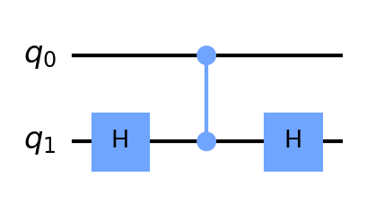

---
note: 另外注意，构造这种电路的时候，经常会把两个H作用于同一个bit，因为 $H^2 = I$

### 4.18

控制bit为q0的情况：
$$
P_0 \otimes I + P_1 \otimes Z
$$

控制bit为q1的情况：

$$
I \otimes P_0 + Z\otimes P_1
$$

验证这两个式子相等就行了

### 4.19 CNOT 对于密度矩阵的作用

contronlNot作用于密度算子$\rho$：$cn \cdot \rho \cdot cn^\dagger$

经过简单计算可知，controlNot先将密度矩阵后两行调换，再将后两列调换。

对于计算基的作用相当于将$|00\rangle , |01\rangle , |10\rangle , |11\rangle$ ，转换成$|00\rangle , |01\rangle , |11\rangle , |10\rangle$

> note：
> 这里说的“对于计算基的作用”指的是
> 
> 将CNOT作用于第一种计算基下的某个密度矩阵得到结果在第二个基下面的密度矩阵等于原来的密度矩阵

### 4.20 CNOT门 基变换

即证明
$$
(H\otimes H)(CNOT)(H\otimes H) = I \otimes P_0 + X\otimes P_1
$$

$$
(H\otimes H)(CNOT)(H\otimes H)  = \left[\begin{matrix}1 & 0 & 0 & 0\\0 & 0 & 0 & 1\\0 & 0 & 1 & 0\\0 & 1 & 0 & 0\end{matrix}\right]\\

 I \otimes P_0 + X\otimes P_1 = \left[\begin{matrix}1 & 0 & 0 & 0\\0 & 0 & 0 & 1\\0 & 0 & 1 & 0\\0 & 1 & 0 & 0\end{matrix}\right]
$$

验证完毕

> note:
> 这个题的意思是说控制量子bit并不是固定的，它取决于选定的基
> 
> 在这个基下面的控制位在另一个基下面可能会变化（就是题目中的这个例子
> 题目中的这个变换是在H作用后的基下面进行的
> 
> ---
> 关于这个题目的意思，我觉得是这样
> 
> 这个量子门的作用是和基没有关系的，量子电路图中一条线表示的是一个量子比特，就是像 $|0\rangle , |1\rangle$ 这种东西，**不是基**
> 题目想说明的是对于一个量子门，在基1下，第一个位是控制位，在基2下，第二个位可能是控制位，也就是说，控制位取决于选择的基（一般选择计算基）
> todo 这块解释的不是很好。。。

---

这四个式子的证明：

$$
\begin{align}

CNOT_[x_1, x_2] |+\rangle |-\rangle  =& CNOT_{x_1, x_2} (H\otimes H)|0\rangle  |1\rangle  \\
=& (H \otimes H) CNOT_{x_2, x_1} |0\rangle  |1\rangle  (这一步用了这个题第一问的结论)\\
=& (H\otimes H) |1\rangle  |1\rangle \\
=& |-\rangle  |-\rangle 
\end{align}
$$

剩下几个都类似这样证明即可

### 4.21

分类讨论

### 4.22

==important==

做法是将控制酉算子代入图 4-8 中， 进行化简

化简过程中用到几个引理

==todo==

### 4.23

感觉题干有点问题，“从3个减少到2个”

感觉$R_y(\theta)$ 可以减少到2个，$R_x(\theta)$ 还得是4个？？

### 4.24

分类讨论直接验证

### 4.25

1. 如下图（q2是控制位）
   
   
   > 这种题感觉就是没什么技巧，凑出来的。。。其实也是有一点方法的，因为 $q_2$ 是不变的，只有三个门，如果要把$q2$作为目标位恐怕要在q2上使用两个Toffioli门，就剩下一个了，显然不够
   >
   > 因此不能把$q_2$作为目标位，那剩下的构造方法就很有限了。

   分类讨论验证：

   * 。。。
2. 如图：
   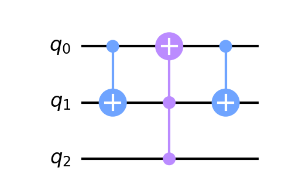

   显然和1.中的电路等价：

   如果$q_2$是1，完全等价

   如果$q_2$是0，第一个和第三个非门会互相抵消

3. 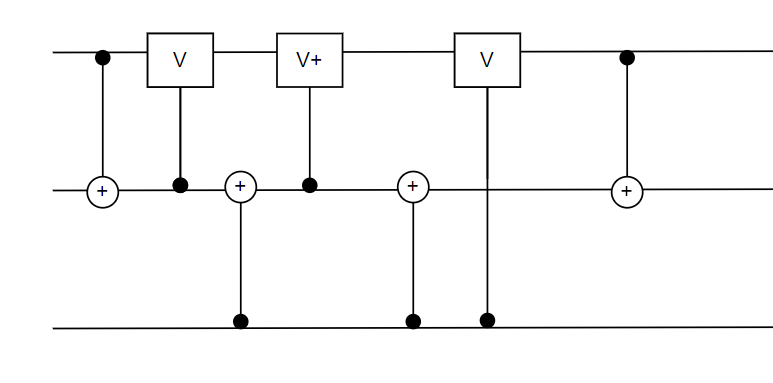

4. 

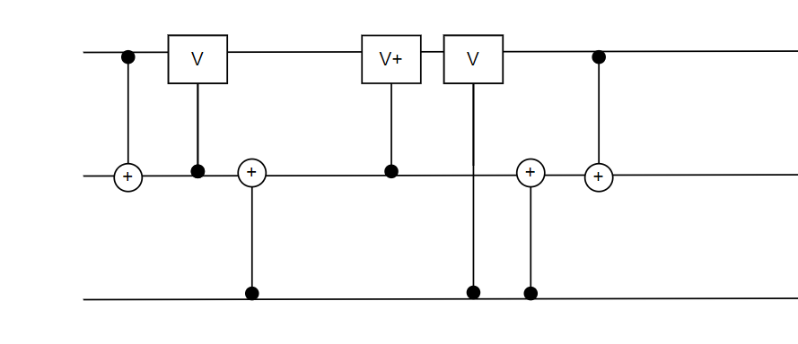

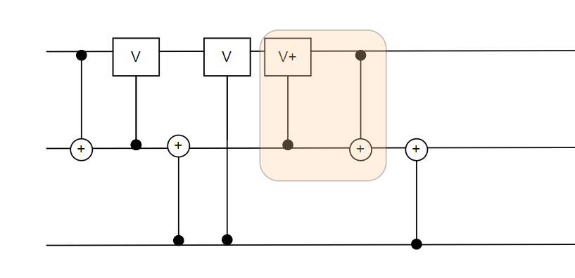

### 4.26

看不懂，，todo

### 4.27

这个题我的做法就是

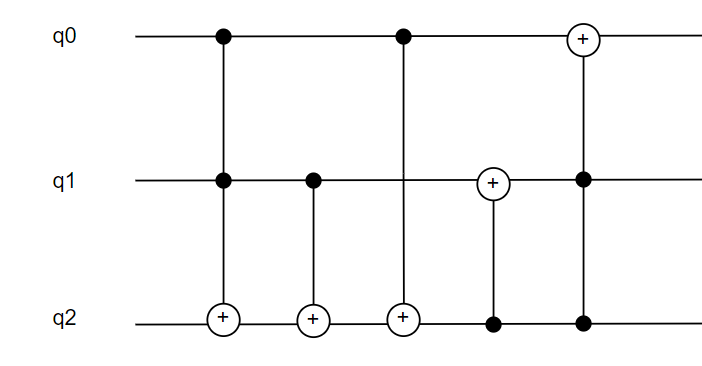

验证(空出来的框表示这个状态没有变化）：

| init | 1    | 2    | 3    | 4    | 5    |
| ---- | ---- | ---- | ---- | ---- | ---- |
| 000  |      |      |      |      | 000  |
| 001  |      |      |      | 011  | 111  |
| 010  |      | 011  |      | 001  | 001  |
| 011  |      | 010  |      |      | 010  |
| 100  |      |      | 101  | 111  | 011  |
| 101  |      |      | 100  |      | 100  |
| 110  | 111  | 110  | 111  | 101  | 101  |
| 111  | 110  | 111  | 110  |      | 110  |

> **再简单说一下我是怎么构造的**
>
> 观察我们要构造的这个门，它对于状态的改变可以如下描述：
> $$
> 0)000 \rarr 000\\ 
> 1)001 \rarr 111\\
> 2)xx1 \rarr xx0\\
> 3)x10 \rarr x01 \\
> 4)100 \rarr 011
> $$
> 给定的这两个门都是控制not门，要想根据给定的这两种门构造所求的门，就得知道哪种情况下某一位会**翻转**
>
> 我是先从q2开始的，上面的2)3)4)第三位都会翻转，条件是$q0 \or q1$，经过基本的等价转换可以变成下图中的下面那个图，再把它转换成只用CNOT和Toffoli门构造的等价形式。
>
> 再看q1，对应上式的1)3)4) 恰好是最终的q2为1的情况，因此使用一个CNOT门就可以得到最终的q1
>
> q0同理。

这两部分是等价的。(下面这两个图中的第一个图的第三个门错了，应该是个CNOT门，上面那个图是对的)

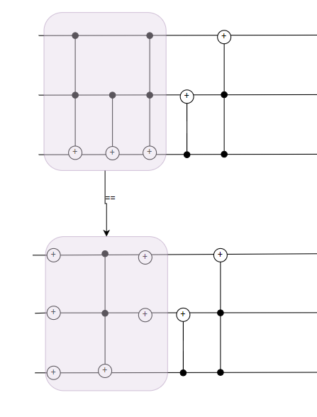

> note 
>
> 书上4.28之前讲一种通用的可以使用Toffoli门和单控U门构造任意**n控U门**（好像记为$C^n(U)$）的方法，但是需要使用工作量子比特，就像这样：
>
> 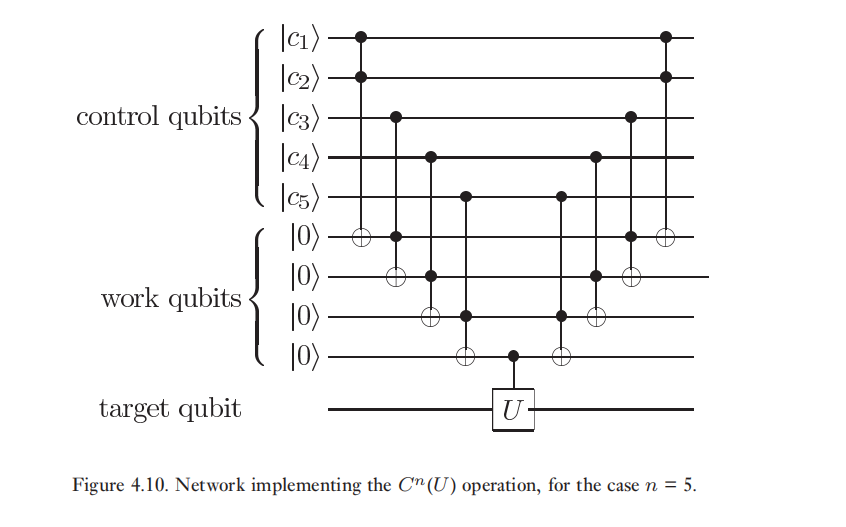

### 4.28

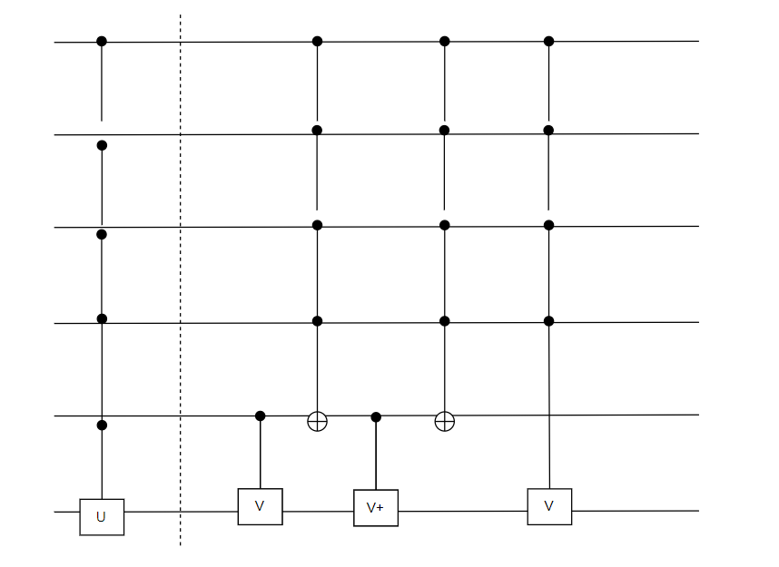

递归的思想，像这样逐步化简，但是需要使用单控的$\sqrt V$，或者使用多控的$V$

但是这份答案上面说不行，我觉得是对题目的理解不同，这个答案可能是理解为了只能使用单控的$V$和单控的$V^\dagger$，不能使用单控的$\sqrt V$

我懂了。

这个链接中的第二个回答，就是利用了行列式中U门次数奇偶性

[4.3 受控运算 — 量子计算与量子信息 习题解答 文档 (qcqi-exercises.readthedocs.io)](https://qcqi-exercises.readthedocs.io/zh_CN/latest/chap_04/sec_04_03.html#fredkin)

### 4.29 4.30

题4.29-4.30关于Cn(X)分解的同学们没做出来，这篇讲分解的论文有结果
https://arxiv.org/pdf/quant-ph/9503016.pdf

==todo==

---

> note
>
> 新记号：
>
> 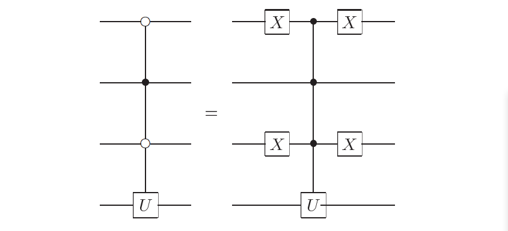
>
> 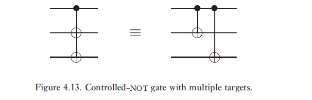

### 4.31

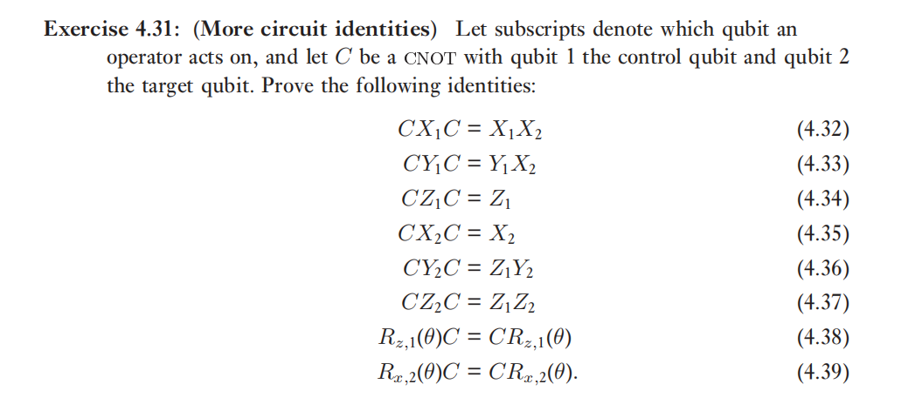
$$
C = P_0 \otimes I + P_1 \otimes X\\
C^2 = I
$$
**4.32**
$$
\begin{align}
    CX_1C &=  (P_0 \otimes I + P_1 \otimes X) (X\otimes I)(P_0 \otimes I + P_1 \otimes X)\\
    &= (P_0 X \otimes I + P_1 X\otimes X)(P_0 \otimes I + P_1 \otimes X)\\
    &= 0 + P_0 XP_1 \otimes X + P_1 X P_0\otimes X + 0\\
    &= (P_0 XP_1 + P_1 X P_0)\otimes X\\
    &= X\otimes X \\
    &= X_1 X_2
\end{align}
$$

**4.33**

$$
\begin{align}
CY_1 C &=  (P_0 \otimes I + P_1 \otimes X) (Y\otimes I)(P_0 \otimes I + P_1 \otimes X)\\
&=...（推导方法和上一个题一模一样）\\
&= Y_1 X_2
\end{align}
$$

**4.34**

$$
\begin{align}
    CX_1C &=  (P_0 \otimes I + P_1 \otimes X) (Z\otimes I)(P_0 \otimes I + P_1 \otimes X)\\
    &= (P_0 Z \otimes I + P_1 Z\otimes X)(P_0 \otimes I + P_1 \otimes X)\\
    &= P_0 Z P_0 \otimes I + 0 + 0 + P_1 Z P_1 \otimes I\\
    &= Z \otimes I \\
    &= Z_1
\end{align}
$$

不写了，前六个推导方式是一样的

**4.38 4.39**

代入下面这个式子以及上面的几个结论(4.34)(4.35)，容易得到。

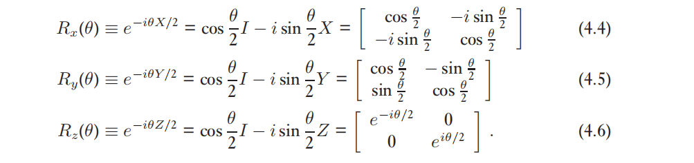

---
over!
OvO

