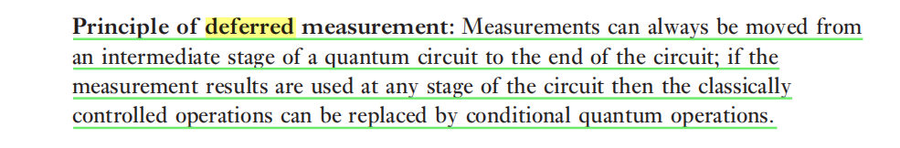
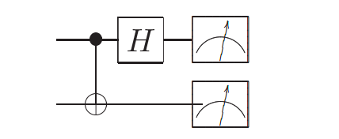
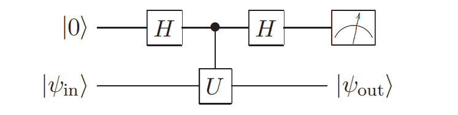
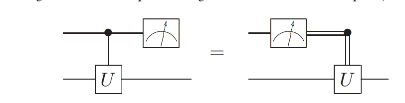

# 4.4 Mearement 测量

> note
> 
> 这一节首先讲了两个关于测量的原理：
>
> 
>
> 延迟测量原理：讲的是可以将测量移动到电路末端，把用到测量结果的地方（经典条件电路）转化为条件量子门，举了一个量子隐形传态的例子
>
> 
>
> 隐含测量原理，指的是 下面这两种做法得到的结果相同
>
> * 在结束的时候只测量我们想要的bit
> * 在结束的时候测量全部bit，只取我们想要的bit

### 4.32

4.32是对于隐含测量原理的一个说明（不算是证明，因为只证明了两个qbit的情况）

---
$\rho$是两qbit系统的密度矩阵，因此可以写成基的线性组合

$$
\rho = \sum _{i,j} \rho _ i\otimes\rho _j 
$$

其中$\rho_i,\rho_j$ 分别是两个系统的基

$$
\rho' = (I\otimes P_0) \rho (I\otimes P_0) +(I\otimes P_1) \rho (I\otimes P_1)\\
(I\otimes P_0) \rho (I\otimes P_0) = \sum_{i,j} \rho_i \otimes (P_0\rho_j P_0)
\\
therefore\\
\begin{align}
    
\rho' &=  \sum_{i,j} \rho_i \otimes (P_0\rho_j P_0 + P_1\rho_j P_1)\\
\end{align}
$$

$(P_0\rho_j P_0 + P_1\rho_j P_1)$ 是仅保留$\rho _j$ 的对角元素，因此$tr(\rho_j) = tr(P_0\rho_j P_0 + P_1\rho_j P_1)$

$$
\begin{align}

tr_2(\rho') &= tr_2( \sum_{i,j} \rho_i \otimes (P_0\rho_j P_0 + P_1\rho_j P_1)) \\   
&= \sum_{i,j} \rho_i \cdot tr (P_0\rho_j P_0 + P_1\rho_j P_1)\\
&=  \sum_{i,j} \rho_i \cdot tr (\rho_j )\\
&= tr_2(\rho)
\end{align}
$$

### 4.33 在贝尔基上测量

$$
CNOT = \left[\begin{matrix}1 & 0 & 0 & 0\\0 & 1 & 0 & 0\\0 & 0 & 0 & 1\\0 & 0 & 1 & 0\end{matrix}\right]\\
H\otimes I = \left[\begin{matrix}\frac{\sqrt{2}}{2} & 0 & \frac{\sqrt{2}}{2} & 0\\0 & \frac{\sqrt{2}}{2} & 0 & \frac{\sqrt{2}}{2}\\\frac{\sqrt{2}}{2} & 0 & - \frac{\sqrt{2}}{2} & 0\\0 & \frac{\sqrt{2}}{2} & 0 & - \frac{\sqrt{2}}{2}\end{matrix}\right]\\
M= (H\otimes I ) \cdot CNOT = \left[\begin{matrix}\frac{\sqrt{2}}{2} & 0 & 0 & \frac{\sqrt{2}}{2}\\0 & \frac{\sqrt{2}}{2} & \frac{\sqrt{2}}{2} & 0\\\frac{\sqrt{2}}{2} & 0 & 0 & - \frac{\sqrt{2}}{2}\\0 & \frac{\sqrt{2}}{2} & - \frac{\sqrt{2}}{2} & 0\end{matrix}\right]
$$

$M$这个矩阵**将bell基变换为计算基**

因此在M作用在qbit之后再做计算基上的投影测量，由测量结果可以

### 4.34 测量一个算子

4.34是测量一个算子的性质（其实就是获取这个算子的特征向量，已知这个算子的特征值为 $\pm 1$(解题要点
$$
|0 \psi_{in}> \rarr \frac 1 {\sqrt{2}} (|0> +|1>) \otimes |\psi_{in}>\\
\rarr
\frac 1 {\sqrt{2}}|0\psi_{in}> + \frac{1}{\sqrt{2}} |1> \otimes U |\psi_{in}> \\
\rarr  \frac 12 (|0> + |1>) \otimes |\psi_{in}> + \frac 12 (|0> - |1>) \otimes U|\psi_{in}>\\
\rarr \frac 12 |0> \otimes (I + U) |\psi_{in}> + \frac 12 |1> \otimes (I - U) |\psi_{in}>
$$

如果测量结果为$|0>$ , 对应的 $|\psi_{out}> = (I + U) |\psi_{in}>$

如果测量结果为$|1>$ , 对应的 $|\psi_{out}> = (I - U) |\psi_{in}>$

将 $\psi_{in}$ 以特征向量为基分解，结果为$|0>$ 的情况只保留其中的特征值为1对应的特征向量，另一种情况只保留特征值为 -1 对应的特征向量。

---

### 4.35 测量与控制交换

对应最前面说的第一个原理，让你证明这两个电路的等价性

==todo== 这个需要证明测量到某个结果的概率相同吗？？

设测量之前的状态为

$$
|\psi> = a_{00} |00> + a_{01} |01> + a_{10} |10> + a_{11} |11>
$$

* 先测量再U

* 先U再测量
$$
|\psi>
\rarr^U  a_{00} |00> + a_{01} |01> + a_{10} U|10> + a_{11} U|11>\\
\rarr ^{mearement} \dots
$$

反正经过验证，两种结果是一样的，说明两个电路的最终状态一样，但是最终得到$|0>或者|1>$ 的概率是否一样？是一样的！测量算子$\{|0><0| \otimes I , |1><1| \otimes I\}$
