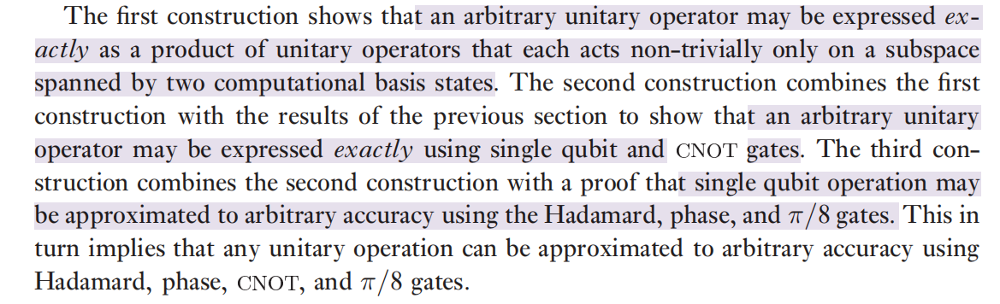
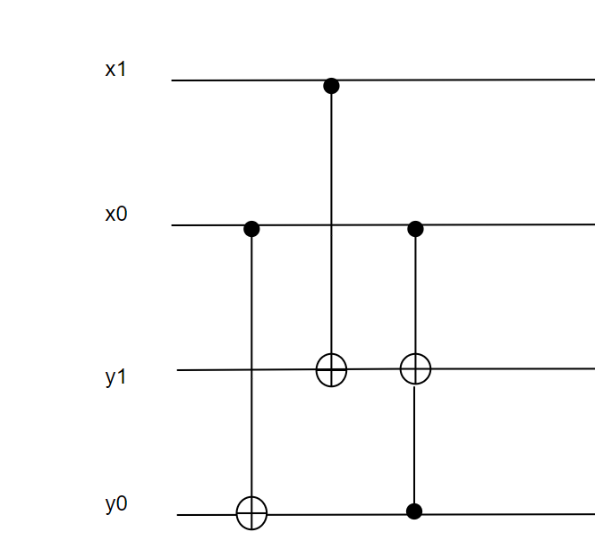
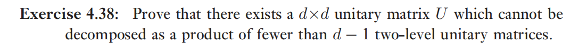
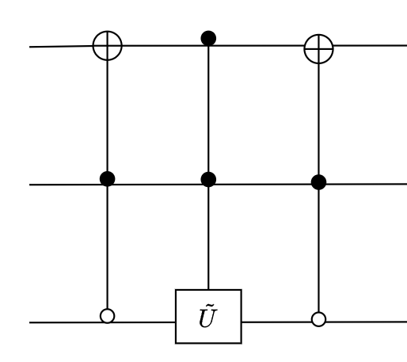
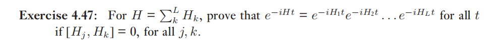
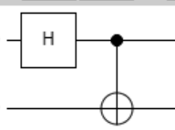

# 4.5 

这一节讲的主要是证明任意酉算子可以被有限种算子以任意精度逼近

证明思路如下:

证明分为三步

* 证明任意酉算子可以被精确表示为两个计算基张成的子空间上的酉算子的乘积
* 证明任意酉算子可以被精确表示为单bit门和CNOT门的乘积
* 证明任意酉算子可以以任意精度被这几种门逼近

分别对应4.5.1 - 4.5.3 的内容

4.5.4说明了逼近的难度

4.5.5 讲了量子计算复杂度

### 4.36

$$
y_0 = x_0 \oplus y_0\\
y_1 = x_1\oplus y_1\oplus (x_0 \times y_0)
$$

### 4.37

套公式应该就行了

值得注意的是这个矩阵好像是量子傅里叶变换，后面会讲（先不看了

### 4.38

这种题一般有两种证明方法

1. 找到例子
2. 给出一个通用的构造方法
3. 反证法？不行吧
4. 从d比较小的情况出发

看了答案是先考虑d = 3的情况，两个two-level矩阵的乘积总有至少一个位置的元素为0，因此不能够成所有的3阶矩阵

==todo==

但是不知道如何推广到更高阶矩阵

使用归纳法吗？

### 4.39

$$
010\\
110\\
111\\
$$

let $\tilde{U} = \left[\begin{matrix}
    a & c\\b&d
\end{matrix}\right]$

## 4.5.3 用离散集合逼近通用运算

### 4.42 $\theta 的无理性$

根据给出的两个步骤就很好证

1. 如果$\theta$ 是2 pi的有理数倍，则
    $$
    \theta = \frac pq 2\pi\\
    
    e^{i\theta} = e^{i \frac pq 2\pi} = (3 + 4i ) / 5\\
    
    1 = e^{i  p 2\pi} = ((3 + 4i)/5) ^ q\\
    $$
    证明完毕

 2.  
    假设原命题对于 $m-1$成立，由归纳法
    $$
    (3 + 4i)^m = (3 + 4i)^{m-1} (3 + 4i)\\ = (3 + 4i)(3 + 4i) = -7 + 14i = 3 + 4i (mod 5)
    $$
    因此对于任意正整数m成立

### 4.43

# 4.6

# 4.7 量子系统的模拟

### 4.47

使用数学归纳法

L = 2的情况

$H= \sum_k^2 H_k, [H_1, H_2] = 0$ 因此 $H_1, H_2$ 可同时对角化
$$
H_k = \sum_i \lambda_{ki} |i><i|, k = 1,2
$$
$$
\begin{align}

e^{-iHt} &= e^{-i(H_1 + H_2)t}\\
&= \sum_k exp\{-i (\lambda_{1k}+ \lambda_{2k})t \} |k><k|\\
&= \sum_k exp\{-i (\lambda_{1k})t \}\ exp\{-i (\lambda_{2k})t \} |k><k|\\
&= \left(\sum_k \exp\{-i\lambda_{1k} t\} |k><k|\}\right)\left(\sum_k \exp\{-i\lambda_{2k} t \}|k><k|\}\right)\\
&= e^{-iH_1t} e^{-iH_2t}
\end{align}
$$

假设对于 $L \le l$ 都成立，则$L =  l + 1$时

$H = \sum_{k}^{l+1} H_k = \sum_k^{l-1} H_k + (H_l + H_{l + 1})$

设 $H_l' = (H_l + H_{l+1})$ 对于小于l的k，$H_k' = H_k$

容易证明 $e^{-iH'_lt} = e^{-iH_lt } e^{-iH_{l + 1}t }$

下面只需要证明$[H_k', H_l'] = 0,\forall k < l$

$$
(H_l + H_{l+1})H_k -H_k(H_l + H_{l+1})\\
= (H_lH_k - H_k H_l) + (H_l H_{k + 1} - H_{k + 1} H_l)\\
 = 0
$$

因此

$$
\begin{align}
    e^{-iHt}&= \prod _{k = 1}^{l} e^{-iH'_k t}\\
    &= \prod _{k = 1}^{l+1} e^{-iH_k t}\\
\end{align}
$$

由归纳法，证明完毕

### 4.48

$$
L \le \sum_{k = 1}^{c}C_n^k =  \sum_{k = 1}^{c} O(n^k) = O(n_k) 
$$

==todo 感觉没太理解这个题目的意思==

> note 
> 定理 4.3 Trotter formula
> 
> todo 话说这个到底有啥用？
> 
> 我的感觉是因为直接用 $e^{-iH\Delta t}$ 不好算（或者是别的原因不能用这个），因此将H分解，使用这个公式...

### 4.51 

利用“X,Y可以通过单量子比特转化为Z操作”

将问题转化为图 4-19

> note
> 对于 4-19 的解释
> 
> 之前一直没有理解“纠缠”，其实简单来说，将两个量子bit通过一个双bit门（例如受控门），就能让两个量子bit产生纠缠，比如第一章说的将量子bit通过H门再通过受控非门就能产生bell态，也就是最常用的几种纠缠态
>
> 
>
> 将one-bit gate 作用于处于纠缠态的qbit之一 会导致与之纠缠的其他qbit状态改变，举个简单的例子：
> $$
> I\otimes Z (|00> + |11>)/\sqrt 2  = (|00> -|11>)/\sqrt 2
> $$
> emmm其实这个时候说不上来是谁的状态改变了，因为两者是一体的
>
> 这种感觉也是和纠缠态的定义是相符的
>
> 纠缠态的定义是**不能被分解为 $(a|0> +b|1>)\otimes (c|0> + d|1>)$ 的两个量子bit**
>
> 如果可以分解的话 当有一个单bit门作用于某个 qbit的时候就直接使用张量积的运算法则

使用 $HZH =  X$，$Y = R_z(-\pi/2) HZH R_z(\pi/2)$

这里面第二个公式从几何上理解也不是很困难

