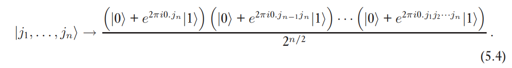
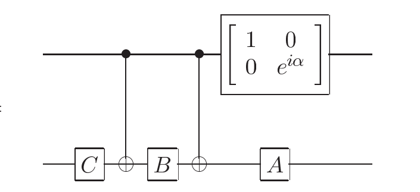
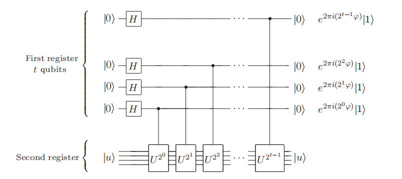
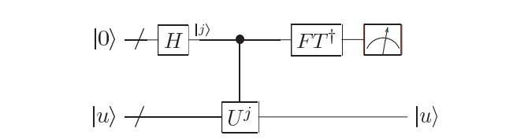
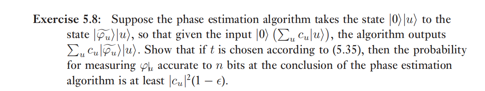
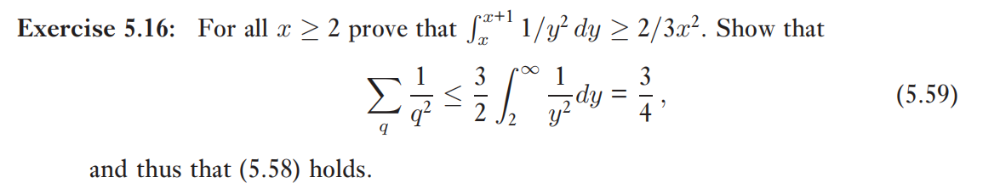
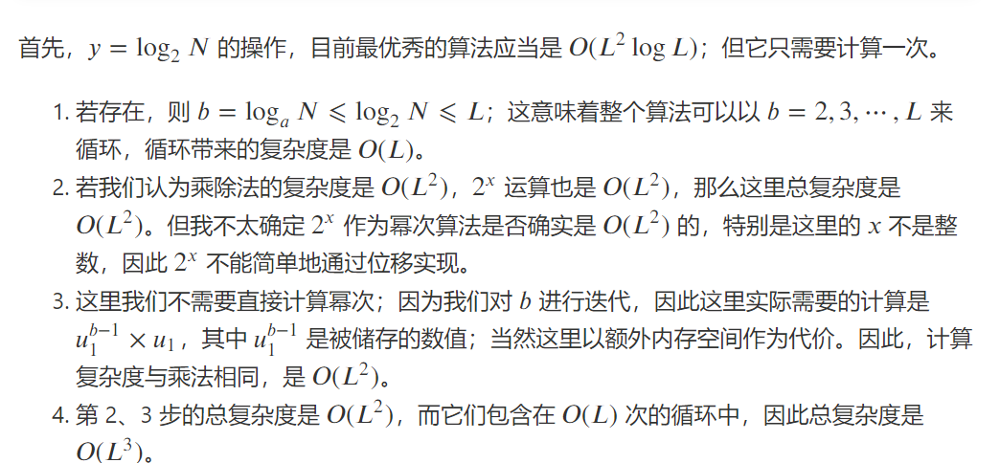
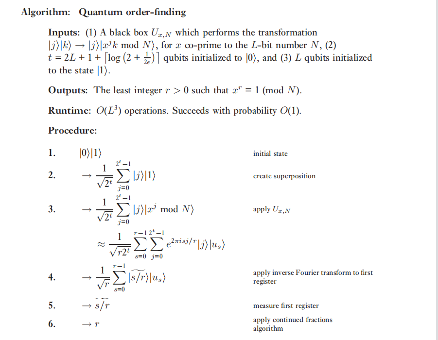
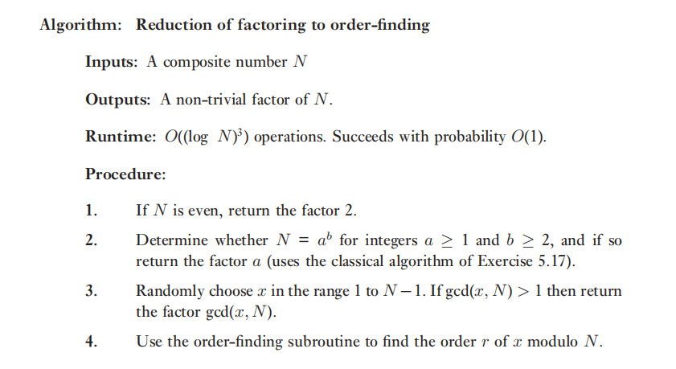
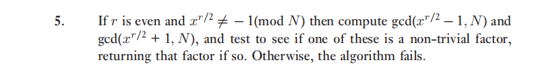

<center><h1>
    Chapter 5 Fourier Transform
</center>

## 5.1 Quntum Fourier Transform

### 5.3 classical FFT

利用式 5.4 



每算一个向量$|j>$ 需要进行n次乘积，共需要算 $N = 2^n$ 个 $|j>$ 

因此复杂度为 $O(n 2^n)$ 

### 5.4

使用第四章的方法
$$
R_k = \left[
    \begin{matrix}
        1&0\\0& e^{2\pi i /2^k}
    \end{matrix}
\right]
$$

需要将 $R_k$ 分解为 $R_k = e^{i\alpha} AXBXC$ 其中 $ABC = I$

这种分解好像没有一般的方法，只能凑？

$$
R_k = e^{-2\pi i / 2^{k+1}} R_z(2\pi / 2^k)
\\

 R_z(2\pi / 2^k) = (R_z{\pi / 2^k}) ^2 =R_z(\pi / 2^k) X R_z(-\pi / 2^k)X
$$
$$
\begin{align}
    
R_k &= e^{-2\pi i / 2^{k+1}} R_z(2\pi / 2^k) \\
&=  e^{-2\pi i / 2^{k+1}}R_z(\pi / 2^k) X R_z(-\pi / 2^k)X\\
\end{align}
$$

let $A = R_z(\pi / 2^k), B = R_z(-\pi / 2^k), C = I$ 

then we have $ABC = I$

分解完成，



代入即可

### 5.5

逆 Fourier变换，可以把电路对调

或者，

$$
x_j = \frac 1 {\sqrt N} \sum_{j = 0} ^{N -1} y_k e^{-2\pi ijk/N}
$$

代入（5.1） 式验证即可证明上式的正确性

### 5.6 

==todo== 看不懂

## 5.2 Phase estimation 

相位估计的目的就是**已知一个算子的特征向量求他的特征值的相位**（也就是说特征值是 $e^{2\pi i \phi}$,那么所说的相位就是 $\phi$

相位估计是QFT的一个应用。

---

下面这个电路对应的是H 门和受控 $U^j$ 门，先来看看这个门是怎么做到的

首先是对第一个寄存器的bit都作用了一个 H gate，作用是把 $|0>$ 转化为 $1/\sqrt{2} (|0> + |1>)$

接下来这个受控门比较微妙，因为它是作用于第二个寄存器的，但是最终改变了第一个寄存器的状态。其实这个取决与你怎么看:

$$
|j>(U^j|u>) = |j> \lambda^j |u> = (\lambda ^j |j> )|u>
$$

也就是说，数乘第二个寄存器可以看做是数乘第一个寄存器

这样就能得到和图中一致的最终状态



上面这个电路就等价于下面的电路中的受控 $U^j$ 门部分




相位估计有三步

1. H门和受控$U_j$ 门
2. 逆傅里叶变换
3. 测量得出第一个寄存器的状态

经过了受控 $U^j$ 门和逆傅里叶变换之后，第一个寄存器变为 $\phi$ ，然后通过测量即可得到


### 5.7 

这里指的电路应该是不包括 H gate 的部分

就是把 j 写成二进制形式就可以证明。

---

上面说的Fourier transform 仅仅讨论了相位可以被二进制精确表示的情况，如果不能精确表示，结果就会产生误差

### 5.8




感觉就是，出现这个本征态的概率为 $|c_u|^2$, 精确到n bit 近似量的概率为 $(1-\epsilon)$ ， 由概率乘法，得到精确到n bit 近似量的概率至少为 $|c_u|^2 (1-\epsilon)$

### 5.9 

也就是说这个由特征向量求特征值的电路也可以用于由特征值求特征向量？

感觉这个只适用于特征值为 $\pm 1$ 的情况。

电路和4.34的电路一样，因为对于一个量子bit的情况 $FT^{\dagger} = H$

---

> note
> 
> 傅里叶变换需要得到每个计算基变换后的结果，对于classical FFT,有2^n个基需要计算，每个基要计算n个系数（公式 5.4），因此复杂度为 $n 2^n$；
> 而对于 QFT，可以直接得到最后的结果而不需要对于多个态计算
> 
> QFT比较块的本质原因我觉得是我们可以用n个 qbit 描述N个状态，这是经典做不到的。

## 5.3 求阶与因子分解

这个算法是相位估计的一个具体应用，是相位估计的一个特例吧。

**求阶**

阶就是抽代里面说的群的阶，对于模N乘法群的阶

定义：
x 模 N 的阶定义为 $x^r = 1 (mod\ N）$的最小正整数r

---

### 5.10

$$
5^6 = 25 ^3 = 4^3 = 64 = 1 (mod \  21)
$$

### 5.11

因为 x, N 没有公因子，所以 $x^r != 0(mod \ N)$

因此 $x^r (mod \ N)$ 的值只可能是 1~N-1

在 r in range (1,N] 必然有至少两个重复

假设 $x^{r_1} = x^{r_2} (mod \ N)$

$$
x^{r_2} = x^{r_1} + kN\\
x^{r_2} - x^{r_1} = kN\\
x^{r_2 - r_1} - 1 = kN/(x^{r_1}) \equiv 0 (mod\ N)\\
then \\
x^{r_2 - r_1} \equiv 1(mod \ N)
$$

$x^{r_2 - r_1} = 1 (mod N)$


> 随想： 集合{$x^r : r \in \N$}什么时候能构成群？
> 
> 只要有幺元就一定有逆元，我觉得能构成群的条件是有幺元

这个题也可以用 Euler函数证明，但是我不会

### 5.12

即证 $\forall y_1, y_2, <y_1|U^\dagger U |y_2>  = \delta_{y_1,y_2}$

下面是证明
$$
<y_1|U^\dagger U |y_2> = <xy_1(mod \ N) | xy_2 (mod \ N)>
$$

if $y_1 =y_2$ 上式等于1

if $y_1 \ne y_2$，如果$y_1,y_2$其中有一个或者两个 $\ge$ N，则
$xy_1(mod \ N) \ne xy_2 (mod \ N)$，上述内积为0

如果两个都小于N，由于 $y_1 \ne y_2, y_1,y_2 \lt N$ ，所以 $y_1 \ne y_2 (mod \ N)$

又因为 x 在模N下是可逆的（由裴蜀定理）， 因此 $y_1 x \ne y_2 x (mod \ N)$

因此上述内积等于 0

证毕

### 5.13


方法1

$$
\begin{align}
    \frac{1}{\sqrt{r}} \sum_{s = 0}^{r-1} |u_s>&= \frac 1r \sum_{s = 0}^{r - 1}\sum_{k = 1}^{r - 1}exp[\frac{-2\pi i sk}{r}] |x^k (mod \ N)>\\
    &= \frac 1r \sum_{k = 0}^{r - 1}\sum_{s = 1}^{r - 1}exp[\frac{-2\pi i sk}{r}] |x^k (mod \ N)>\\
    &=  \frac 1r \sum_{k = 0}^{r - 1} r \delta_{k0} |x^k (mod \ N)>\\
    &= |x^0 (mod \ N)> \\
    &= |1>
\end{align}
$$

方法2

按照题目提示的方法，先证明 
$$
\frac{1}{\sqrt{r}} \sum_{s = 0} ^ {r - 1} e^{2 \pi i sk /r} |u_s> = |x^k mod \ N>
$$

然后代入 k = 0 即可得到要证明的结果

上式的证明方法和方法1是一样的，只不过这里的k要换个记号

### 5.14

$$
U^j|1> = |x^j mod \ N>\\
V|0> = |0 + x^j nod \ N> = U^j |1>
$$

构造算法类似于前面算 $U^j$ 的算法，快速幂，只不过把最后的乘法换乘加法就行

**连分式展开**

经过前面的电路，我们还不能得到r，只能得到对于某个 s: $\phi \approx s/r$

然后我们需要由这个分数的值算出分母 r

下面介绍的“连分式算法”可以找出互素的 $s',r'$ 序列，然后通过验证就能判断是否是我们要求的阶。

然而麻烦的是如果原来s和r不是互素的，那么我们如果只算一次s和r的值是得不到原来的r的，这个问题有三种解决方法...

> note 
> 
> 关于第三种解决方法
> 已知 $s_1/r = s_1'/r_1',s_2/r = s_2'/r_2'$并且 $s_1',s_2'互素$
> 
> 由这个是怎么推出来
> r是最小公倍数的？
> 
> bhys 数论太烂了呜呜
> 
> 我证不出来。就是说，因为$s_1',s_2'$ 是互素的，所以$s_1,s_2$ 的公因子都被约掉了，说明 $r$ 中包含了 $s_1,s_2$ 的公因数，也就是说 $gcd(s_1,s_2) | r$
> 或许可以这么直观理解，因为 $s_1,s_2$ 被约掉的公共部分是
> 我们想看的是，$r$ 中有没有公共部分在两个式子中被约掉，如果 $k_1.k_2$ 不含有公因数，就说明。。。
>
> 啊这不行啊
> 
> 比如 $6/16，8/16$ ,r = 16,不等于那个最小公倍数
> ==todo== 存疑
> 
---

### 5.15

证明一下求最小公倍数的这个公式吧

设 $d = xy/gcd(x,y)$

then $x | d, y | d$

then d是 x,y的公倍数 ,$[x,y] | d$ 

因为 $x | [x,y], (y/gcd) | [x,y]$

$x, y/gcd$ 互素，因此 $xy/gcd | [x,y] \rArr d | [x,y]$

因此 $d = [x,y]$

---

Eucid 算法的复杂度？ $O(N)$
但是每次取模运算的复杂度应该是 $O(n^2)$ ，那这个算法应该是$O(N^3)$ 吗?
### 5.16



这个两个结论都挺容易证明的
$$
\int _x ^{x + 1} 1/y^2 \ dy = \frac{1}{x(x + 1)} = \frac 1 {\frac 32 x ^2 - \frac 12 x^2 + x} \ge \frac 2 {3x^2}
$$

$$
\sum _q \frac 1 {q^2} \le \frac 32 \int _ 2 ^\infty \frac 1 {y^2} \ dy= \frac 34
$$

### 定理 5.2 的证明

因为 $x^2 -1 = (x + 1) (x -1) = 0 (mod \ N)$

因为 $x \ne \pm 1(mod \ N)$ 而x的取值范围为 $[1,N]$，所以可以得到  $x \ne 1, x\ne N-1$

因为 $N | (x + 1) (x - 1)$

如果那两个最大公因数里面有非平凡因子，则可能是 $(x + 1,N) = N$ 或者 $(x +1,N) = 1$ 或者 $(x-1,N) = 1$

一一排除即可

### 5.17

1. $N\le 2^L$，$a^b \le 2^L$，如果 $N \ne 1$，则 $a \ge 2$，则$b \le L$

2. 题目中说的y就是 $log_2 a$

   $y = log_2 N = b\ log_2 a \rArr x = y/b = log_2 a$，a如果存在，就在最接近 $2^x$ 的两个数中间，只需要验证这两个数字就行。

   对于不同的b，这一步只需要求 y/b 再求 2^x 就行了，注意这里的x不一定是整数

   复杂度也许是$O(N^2)$? ==todo== 得再去查查资料

   [algorithm - Not sure what do Nielsen and Chuang mean by number of operations - Quantum Computing Stack Exchange](https://quantumcomputing.stackexchange.com/questions/11394/not-sure-what-do-nielsen-and-chuang-mean-by-number-of-operations)

3. 

   存疑，这份答案是这么写的，但是我感觉这个算法对于不同的b，第二步会算出来不同的 u_1 u_2 所以感觉上述方法不对，这个复杂度应该是 $O(L^3)$==todo==

4. 编写伪代码

   ```python
   if N == 0: return (1,1);
   y = log_2(N)
   for b in range(2,L):
   	x = y/b
       u_1 = int(2^x)
       u_2 = u_1 + 1
       
       if (u_1^b == N ):
           return (u_1, b)
       
       if (u_2^b == N ):
           return (u_2, b)
   return false
   ```

### 5.18

直接算就行，求gcd使用Eucid算法

### 5.19

2,3,5,7,11,13 质数

9 = 3 ^2


## 5.4 General applications of the quantum Fourier transform

这一节讲的是量子 Fourier Transform 的一般应用，主要讲了三个问题 周期查找、离散对数、隐含子群


### 5.20

bacause r | N, suppose N = Kr

$$
\begin{align}
    \hat f(l) &= \frac{1}{\sqrt{N}} \sum_{x = 0}^{N - 1}e^{-2\pi ilx/N} f(x)\\
    &= \frac{1}{\sqrt{N}} \sum_{k = 0}^{K-1} \sum_{x = 0}^{r - 1} e^{-2il(x + kr)/N} |f(x)>\\
    &= \frac{1}{\sqrt N} \sum_{x = 0}^{r - 1} \sum_{k = 0}^{K - 1} e^{-2\pi ilx/N} e^{-2\pi i l(kr)/N} |f(x)>\\
    &= 0 (if \  N/r \nmid l) 
    \\ else \\
    \hat f(l) &= \frac{1}{\sqrt{N}} \sum_{x = 0}^{r - 1} e^{-2\pi ilx/N}  \frac{N}{r}|f(x)>\\
    &= \frac{\sqrt{N}}{r} \sum_{x = 0}^{r - 1} e^{-2\pi ilx/N}  |f(x)> 
\end{align}
$$

和 5.63 相比，感觉就是前面的系数相差一个 $N/r$ 倍

---

### 5.21

1. 特征值是  $e^{2\pi i lx_0/r}$

$$
\begin{align}
    U_y |\hat f (l)> &=\frac{1}{\sqrt{r}} \sum_{x = 0}^{r - 1} e^{-2\pi i lx/r} |f(x + x_0)>\\
    &= \frac{1}{\sqrt{r}}e^{2\pi i x_0 /r}\sum_{x = 0}^{r - 1} e^{-2\pi i l(x + x_0)/r} |f(x+x_0)>\\
    &= e^{2\pi i x_0 /r} |\hat f (l)> 
\end{align}
$$
2. 啊对对对 
# Chapter5 总结

复习一下，这一章先讲了量子 傅里叶变换，给出了具体实现电路，重点公式是 （5.4），量子傅里叶变换的乘积形式，利用这个乘积形式可以构造一些受控单bit门组成的电路，得到量子Fourier变换的结果。

之后都是将QFT（quantum Fourier Transform）的应用.

5.2 讲了**相位估计**（phase estimation），就是求一个已知算子的特征值。这一节给出的电路后面很具有参考价值，后面几节对于QFT（quantun Fourier transform）的应用都是使用的和这个电路差不多的电路，因此有必要再贴一遍这个图：


* H gate为什么应用如此广泛？因为我们使用H gate 来制造叠加，然后我们的第0个寄存器就有了 $2^N$ 个态相加，然后将第0个寄存器作为控制寄存器，让门作用于第二个寄存器，~~就会得到一些神秘的东西~~。然后对第一个qbit作用逆QFT，就得到了最终结果。

量子计算的核心就是**利用态的叠加**。量子QFT之所以复杂度比经典的小是因为经典的算法需要对每个计算基计算它Fourier变换之后的结果，而QFT因为n个量子bit可以表达 2^n 个基的信息，我们可以同时对他们进行处理，所以没有$2^n$.而复杂度表达式 $O(n^2)$ 中的那个n是来源于计算 $e^{2\pi i 0.j_k...j_n}|1>$

再看相位估计，逆FT的作用是将相位中的信息以振幅（？）的形式表达出来，由此可以测量。就如上面那个电路，在 逆 FT 之前 我们要求的东西就已经蕴含在相位中了，但是经过 $FT^\dagger$ 我们才可以测量。所以这个东西叫相位估计，相位估计这个词语说的是 QFT在这里的作用，而不是这个算法本身叫做相位估计。（我的理解）

叠加态对于求特征值的意义是什么？QFT决定了我们必须要有每个计算基的信息才能计算出相位，那么我就需要有叠加态。也就是说，叠加是为了使用QFT得到最终结果。（这块我理解的不是很好）

**5.3 节讲的是求阶和因子分解**

求阶到因子分解其实是一个经典的过程（就是说，因子分解相对于求阶没有加入更多的量子算法。

先讲**求阶**

求阶的算法如下。就是将上面电路里面的 $U^j|y>$ 换成 $|x^jy (mod \ N)>$

其实就是将一个具体的算子代进去。

另外，我们是不知道（或者难以制备）这个算子的本征向量的，但是我们很容易得到这些本征向量的一个线性组合（可以线性组合为 $|1>$），就可以使用$|1>$ 作为第二个寄存器的初始值，但是这使结果变得不确定。that's a tradeoff。

由一些数学推导，我们知道我们最后求出来的“本征值”的相位是 $s/r$ 其中s是一个随机的值（我们的计算基中的随机一个），r是我们要求的阶。

然后可以用一些数学方法（连分式算法）算出来 r。但是有的时候是算不出来的，有以下原因：

* s/r 本来不是既约的
* 由于求相位的误差使得结果算不出来
* ...

解决方案只能测多次。然后可能会使用一些数学手段计算。书上给出了三个解决办法...



**再来看因式分解**

因式分解就是用到了求阶算法的一个算法，所以把这两个算法放在一起。





主要是用到了一个数论里面的定理（定理5.2）

**5.4 介绍了一些其他的应用**

从前面可以看到，QFT的作用就是把相位变换到寄存器对应的值，如果我们要测量相位就可以使用QFT。这是这一节的要点。
划重点：**使用数学手段凑出来傅里叶变换的形式-> 使用逆傅里叶变换。**

首先介绍了**周期查找**，就是寻找一个定义在整数上的函数的周期。
这里给出了两种办法，一种是前面给出来的算法，另一个是后面习题 5.21 提到的。 

这里来具体说说 5.21 的方法。这个方法比较一般（一般指的是和前面的方法比较像），就是构造一个酉算子，这个算子的本征值的相位含有要求的东西，然后使用前面说的相位估计算法求。

然后前面给出来的做法是另一个，也可以从数学上证明他成立。

然后是